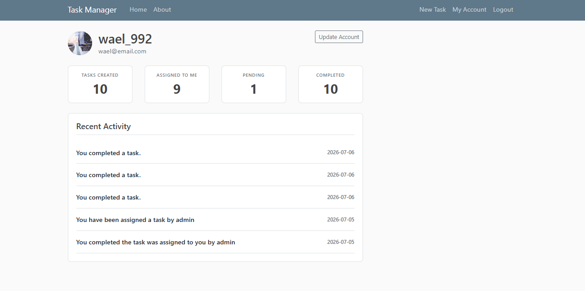
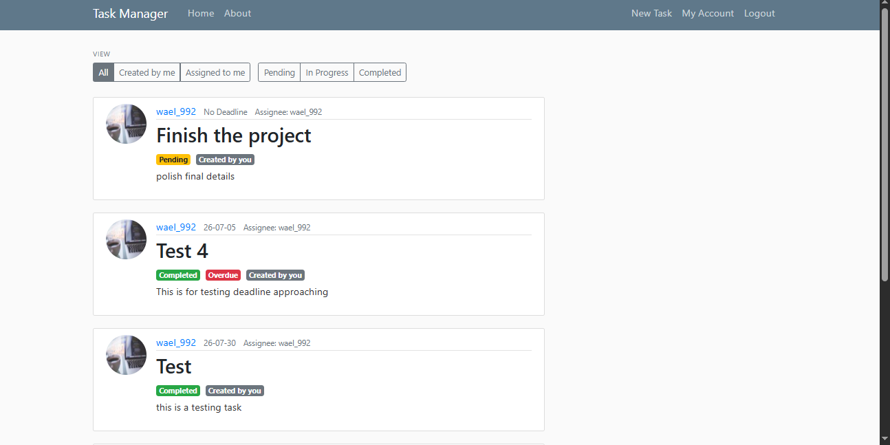
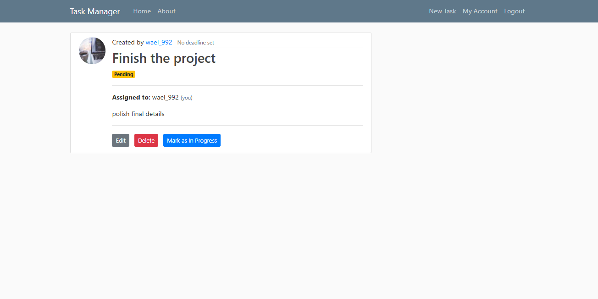
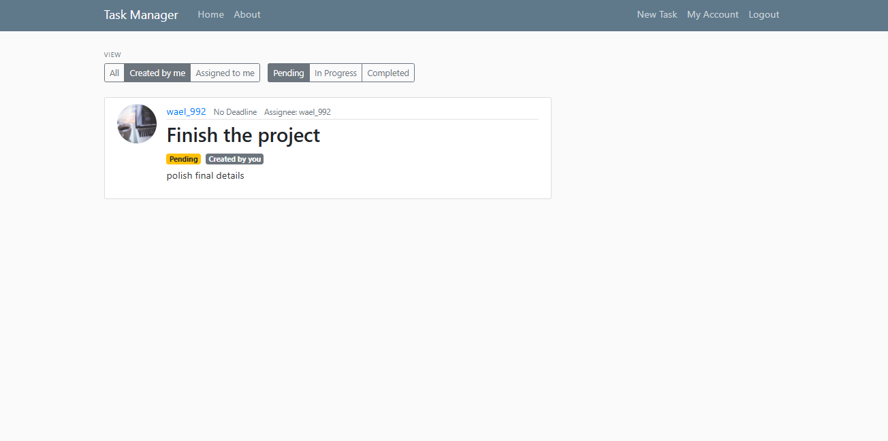
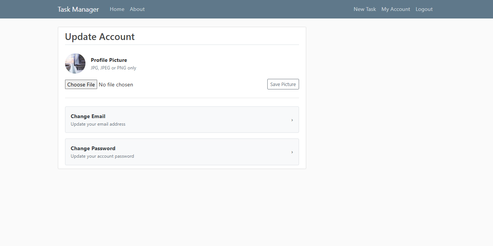
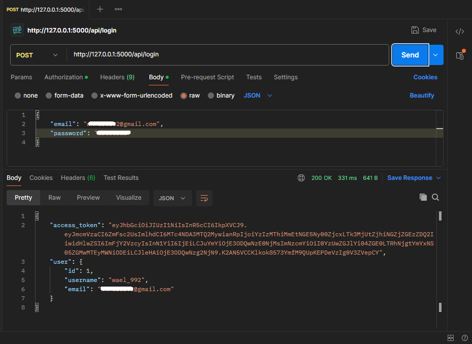
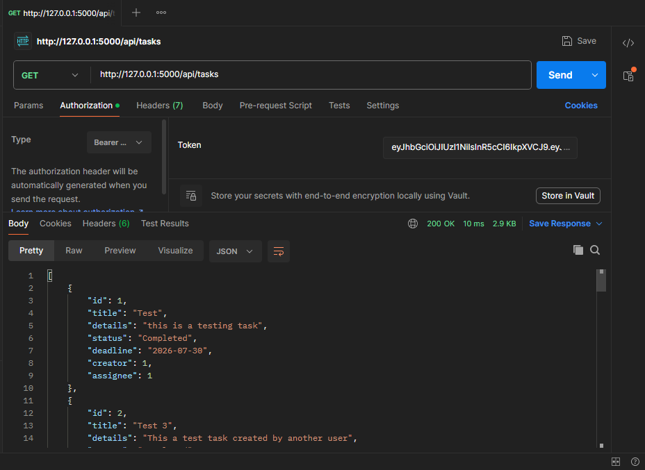
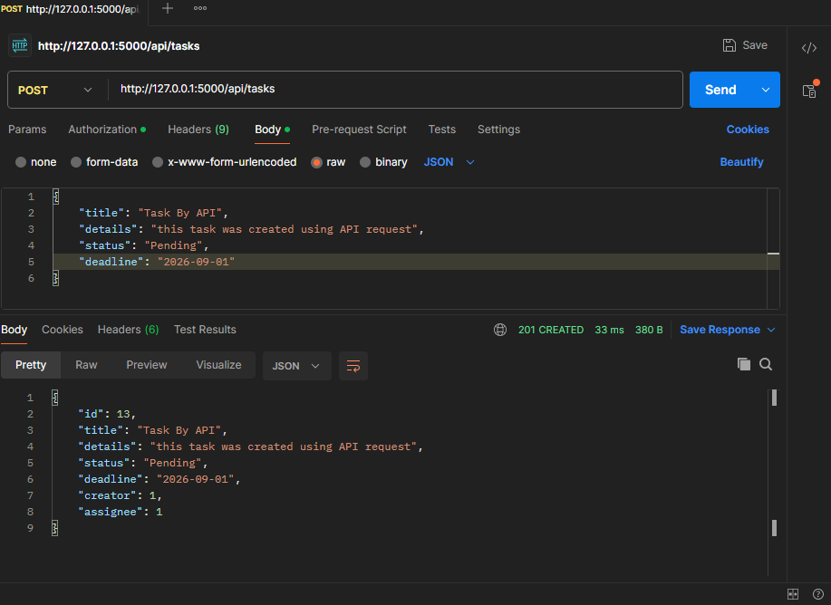

# Task Management System

A Flask-based task management application with both a web interface and a REST API. Users can create and assign tasks, manage task status, receive notifications, and authenticate via JWT-protected API endpoints.

---
## Screenshots
### Dashboard

---

### Tasks List

---

### Task Details

---

### Filter Tasks by Status

---

### Update Account

---

---

## REST API (Postman)

### Login (JWT Authentication)

Authenticate using your email and password to receive a JWT access token.

---

### Get All Tasks (Protected Endpoint)

Retrieve all tasks using a valid JWT Bearer token.

---

### Create a Task

Create a new task through the REST API.

---
## Features
- **User Authentication** — Register, login, logout with secure password hashing (bcrypt)
- **Password Reset** — Token-based password reset via email (itsdangerous + Flask-Mail)
- **Account Management** — Change email address and password independently with current password verification
- **Task Management** — Full CRUD: create, view, edit, and delete tasks
- **Task Assignment** — Assign tasks to other registered users or keep them for yourself
- **Role-Based Access Control** — Edit and delete restricted to task creator; status updates available to both creator and assignee
- **Task Status Flow** — Tasks progress through Pending → In Progress → Completed
- **Filtering** — Filter tasks by ownership (created / assigned) and by status
- **Pagination** — Paginated task list with filter persistence across pages
- **Recent Activity** — Notification system tracking assignment and completion events
- **Account Dashboard** — Stats cards showing created, assigned, pending, and completed task counts
- **REST API** — Full API layer with JWT authentication, task CRUD endpoints, status filtering, and role-based access control mirroring the web application

---
## Tech Stack

| Layer | Technology |
|---|---|
| Backend | Python, Flask |
| Database | SQLite, SQLAlchemy ORM |
| Authentication | Flask-Login, Flask-Bcrypt |
| Forms & Validation | Flask-WTF, WTForms |
| Email | Flask-Mail |
| Token Signing | itsdangerous |
| Frontend | Jinja2, Bootstrap 4 |

---

## Data Models

### User
- `id`, `username`, `email`, `password`
- Relationships: `created_tasks` (tasks created by user), `assigned_tasks` (tasks assigned to user)

### Task
- `id`, `title`, `details`, `deadline`, `status`
- `creator` → Foreign Key to `User`
- `assignee` → Foreign Key to `User`
- Both foreign keys explicitly declared to resolve SQLAlchemy ambiguity

### Activity
- `id`, `type`, `details`, `task_id`, `user_id`, `created_at`
- Types: `Assignment`, `Completion`
- 
### Entity Relationship Diagram (ERD)

---
## Recent Activities
 
The app generates activity records on the following events:
 
| Event | Who Gets Notified | Message |
|---|---|---|
| Task assigned to another user | Assignee | `You have been assigned a task by [creator]` |
| Creator completes their own task | Creator | `You completed a task` |
| Assignee completes an assigned task | Assignee | `You completed the task assigned to you by [creator]` |
| Assignee completes a task | Creator | `[assignee] has completed the task you assigned him` |
 
---

## Usage

1. Register an account
2. Create a task — assign it to yourself or another registered user by username
3. View your task list — filter by status or ownership
4. Update task status as work progresses (`Pending → In Progress → Completed`)
5. Check your account dashboard for task stats and recent activity
6. Edit or delete tasks you created

---

## Access Control

| Action | Creator | Assignee | Others |
|---|---|---|---|
| View task | ✅ | ✅ | ❌ 403 |
| Edit task | ✅ | ❌ 403 | ❌ 403 |
| Delete task | ✅ | ❌ 403 | ❌ 403 |
| Update status | ✅ | ✅ | ❌ 403 |

---
## Future Improvements 
- Adding Blueprints
- Adding Notification feature

